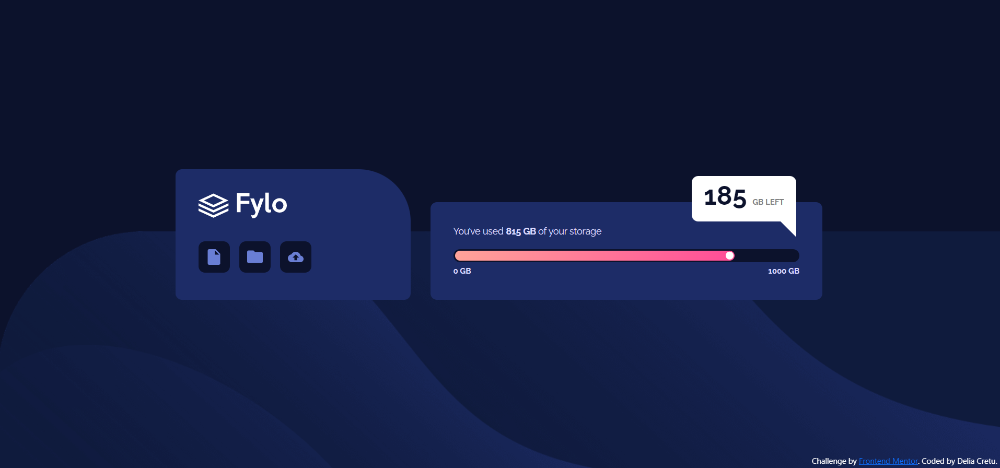

# Frontend Mentor - Fylo data storage component solution

This is a solution to the [Fylo data storage component challenge on Frontend Mentor](https://www.frontendmentor.io/challenges/fylo-data-storage-component-1dZPRbV5n). Frontend Mentor challenges help you improve your coding skills by building realistic projects.

## Table of contents

- [Overview](#overview)
  - [The challenge](#the-challenge)
  - [Screenshot](#screenshot)
  - [Links](#links)
- [My process](#my-process)
  - [Built with](#built-with)
  - [What I learned](#what-i-learned)
  - [Continued development](#continued-development)
  - [Useful resources](#useful-resources)

## Overview

### The challenge

Users should be able to:

- View the optimal layout for the site depending on their device's screen size
- See hover states for all interactive elements on the page

### Screenshot



### Links

- Solution URL: https://github.com/delia-cretu/fylo-data-storage-component-master
- Live Site URL: https://delia-cretu.github.io/fylo-data-storage-component-master/

## My process

### Built with

- Semantic HTML5 markup
- CSS custom properties
- Flexbox

### What I learned

I figured out how to place svg images in individual square-shaped divs:

```css
.icon {
  display: inline-block;
  position: relative;

  margin: 35px 10px 0 0;
  width: 48px;
  height: 48px;
  border-radius: 10px;
  overflow: hidden;

  background-color: hsl(229, 57%, 11%);
}
```

And how to center the svg image inside the div:

```css
.icon img {
  position: absolute;
  transform: translate(-50%, -50%);
  left: 50%;
  top: 50%;
}
```

I figured out how to make a progress bar from scratch:

```css
.progress-bar-container {
  height: 20px;
  width: 100%;
  border-radius: 10px;
  border: 3px solid hsl(229, 57%, 11%);
  background-color: hsl(229, 57%, 11%);
  margin-bottom: 5px;
  position: relative;
}

.progress-bar {
  height: 100%;
  width: 81.5%;
  border-radius: 10px;
  background-image: linear-gradient(
    to right,
    hsl(6, 100%, 80%),
    hsl(335, 100%, 65%)
  );
  position: absolute;
}

.progress-point {
  background-color: white;
  height: 12px;
  width: 12px;
  border-radius: 100%;
  position: absolute;
  z-index: 2;
  transform: translate(-100%, 12%);
  left: 81.2%;
}
```

I learned how to make a chat box shape in CSS:

```css
.cloud {
  text-align: center;
  width: 160px;
  height: 70px;
  background: white;
  position: relative;
  -moz-border-radius: 10px;
  -webkit-border-radius: 10px;
  border-radius: 10px;
  border-bottom-right-radius: 0;
  position: absolute;
  top: 10px;
  right: 40px;
}
.cloud:before {
  content: "";
  position: absolute;
  left: 84.5%;
  top: 69px;
  width: 0;
  height: 0;
  border-top: 0px solid transparent;
  border-right: 25px solid white;
  border-bottom: 25px solid transparent;
}
```

### Continued development

I first tried to generate a progress bar using bootstrap but the aria-valuenow attribute didn't work and I couldn't understand why. This turned out to be a silver lining as it challenged me to generate a progress bar from scratch using CSS. But it means I my understanding of Boostrap and their documentation is lacking and I have to practice Bootstrap features more in order to harness the full potential of this tool.

### Useful resources

- https://www.w3schools.com/css/css3_gradients.asp - Useful resource for making gradient colors.
- https://css-tricks.com/the-shapes-of-css/ - Useful resource for making shapes in CSS, including the chat box.
